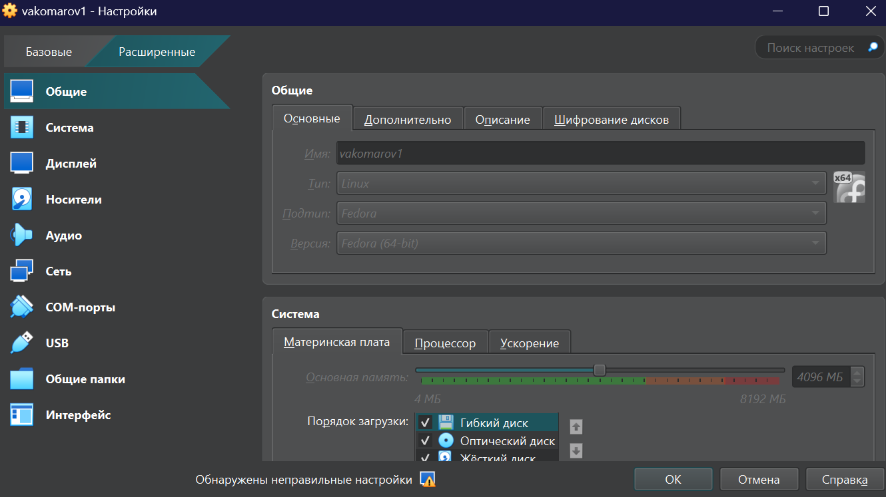
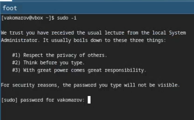
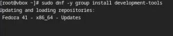
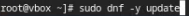
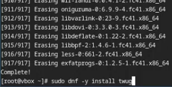
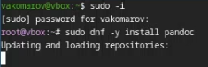
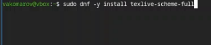
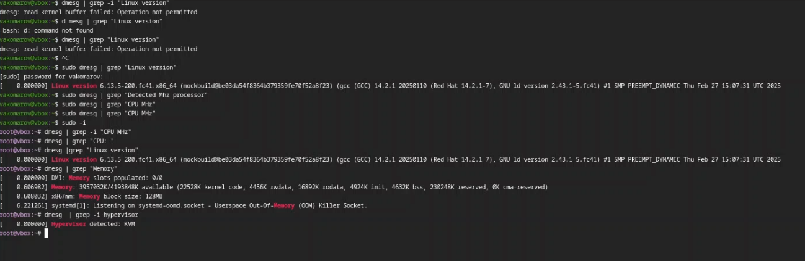

---
## Front matter
lang: ru-RU
title: Отчет по лабораторной работе №1
subtitle: Операционные системы
author:
  - Комаров Владимир Артемович
institute:
  - Российский университет дружбы народов, Москва, Россия

## i18n babel
babel-lang: russian
babel-otherlangs: english

## Formatting pdf
toc: false
toc-title: Содержание
slide_level: 2
aspectratio: 169
section-titles: true
theme: metropolis
header-includes:
 - \metroset{progressbar=frametitle,sectionpage=progressbar,numbering=fraction}
---

# Информация

## Докладчик

:::::::::::::: {.columns align=center}
::: {.column width="70%"}

  * Комаров Владимир Артемович
  * НКАбд-02-2024 № Студенческого билета: 1132246757
  * Российский университет дружбы народов
  * <https://github.com/kerfarion/study_2024-2025_os-intro>

:::
::: {.column width="30%"}

:::
::::::::::::::

## Цели работы

Целью данной работы является приобретение практических навыков установки операционной системы на виртуальную машину, настройки минимально необходимых для дальнейшей работы сервисов.

## Задачи

1) Запуск VirtualBox и создание новой виртуальной машины (операционная система Linux, Fedora).
2) Настройка установки ОС.
3) Перезапуск виртуальной машины и установка драйверов для VirtualBox.
4) Подключение образа диска дополнений гостевой ОС.
5) Установка необходимого ПО для создания документации.
6) Выполнение домашнего задания.

## Теоретическое введение

Операционная система - это комплекс взаимосвязанных программ, который действует как интерфейс между приложениями и пользователями с одной стороны и аппаратурой компьютера с другой стороны. VirtualBox - это специальное средство для виртуализации, позволяющее запускать операционную систему внтури другой. С помощью VirtualBox мы можем также настраивать сеть, обмениваться файлами и делать многое другое.

## Выполнение лабораторной работы

## Создание виртуальной машины

Устанавливаем образ виртуального окружения fedora sway spin  с официального сайта, после заходим в virtualbox и нажимаем добавить виртуальную машину, указываем имя и другие параметры.

{#fig:001 width=70%}

## Установка обновлений

Заходим в режим суперпользователя с помощью команды sudo -i.

{#fig:002 width=70%}

с помощью утилиты dnf устанавливаем development-tools.

{#fig:003 width=70%}

С помощью всё той же утилиты делаем update чтобы обновить все устаревшие пакеты.

{#fig:004 width=70%}

## Повышение комфорта работы

Установим более красивую и функциональную консоль tmux.

{#fig:005 width=70%}

## Установка библиотек для работы в текслайв

Устанавливаем пандок с помощью dnf.

{#fig:008 width=70%}

Устанавливаем из гитзхаба pandoc-crossref, распаковываем его и закидываем в папку usr/local/bin, после этого устанавливаем texlive.

{#fig:009 width=70%}

## Домашнее задание

Пытаемся узнать информацию о запуске линукс.

{#fig:010 width=70%}

## Литература

1. Кулябов Д. С. Введерние в операционную систему UNIX - Лекция.
2. Таненбаум Э., Бос Х. Современные операционные системы. - 4-е изд. -СПб. : Питер, 2015. - 1120 с.

## Вывод

В результате выполнения лабораторной работы были приобретены навыки установки операционной системы на виртуальную машину, а также настройки минимально необходимых для дальнейшей работы сервисов.
:::

