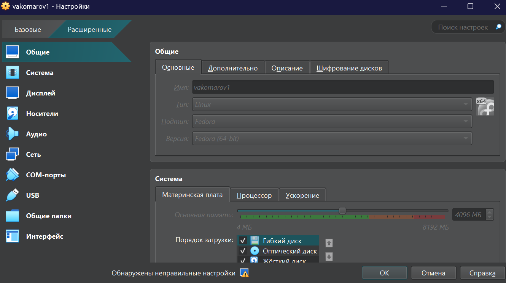
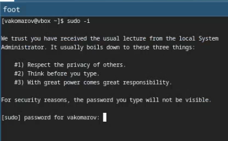
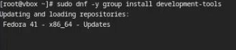
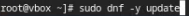
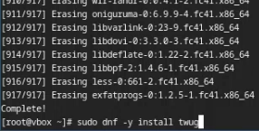
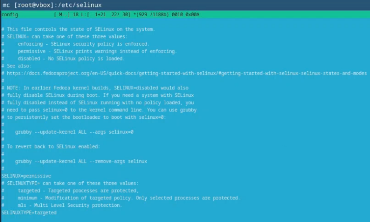
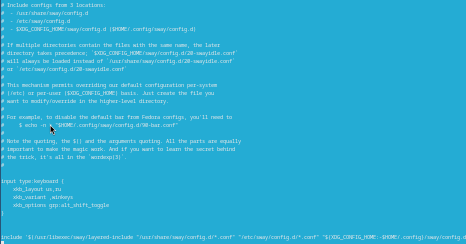
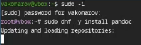
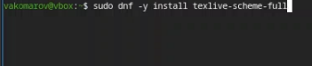
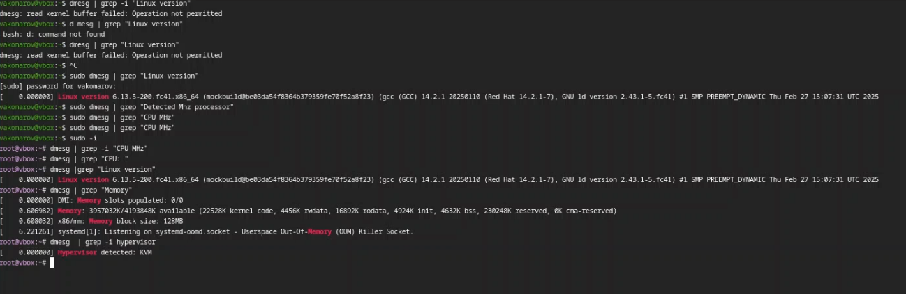

---
## Front matter
title: "Отчёт по лабораторной работе номер 1"
subtitle: "Дисципоина: операционные системы"
author: "Комаров Владимир Артемович"

## Generic otions
lang: ru-RU
toc-title: "Содержание"

## Bibliography
bibliography: bib/cite.bib
csl: pandoc/csl/gost-r-7-0-5-2008-numeric.csl

## Pdf output format
toc: true # Table of contents
toc-depth: 2
lof: true # List of figures
lot: true # List of tables
fontsize: 12pt
linestretch: 1.5
papersize: a4
documentclass: scrreprt
## I18n polyglossia
polyglossia-lang:
  name: russian
  options:
	- spelling=modern
	- babelshorthands=true
polyglossia-otherlangs:
  name: english
## I18n babel
babel-lang: russian
babel-otherlangs: english
## Fonts
mainfont: IBM Plex Serif
romanfont: IBM Plex Serif
sansfont: IBM Plex Sans
monofont: IBM Plex Mono
mathfont: STIX Two Math
mainfontoptions: Ligatures=Common,Ligatures=TeX,Scale=0.94
romanfontoptions: Ligatures=Common,Ligatures=TeX,Scale=0.94
sansfontoptions: Ligatures=Common,Ligatures=TeX,Scale=MatchLowercase,Scale=0.94
monofontoptions: Scale=MatchLowercase,Scale=0.94,FakeStretch=0.9
mathfontoptions:
## Biblatex
biblatex: true
biblio-style: "gost-numeric"
biblatexoptions:
  - parentracker=true
  - backend=biber
  - hyperref=auto
  - language=auto
  - autolang=other*
  - citestyle=gost-numeric
## Pandoc-crossref LaTeX customization
figureTitle: "Рис."
tableTitle: "Таблица"
listingTitle: "Листинг"
lofTitle: "Список иллюстраций"
lotTitle: "Список таблиц"
lolTitle: "Листинги"
## Misc options
indent: true
header-includes:
  - \usepackage{indentfirst}
  - \usepackage{float} # keep figures where there are in the text
  - \floatplacement{figure}{H} # keep figures where there are in the text
---

# Цель работы

Целью данной работы явлеяется приобретение практических навыков для работы с виртуальной машиной и установки на неё операционной системы.

# Задание

В лабораторной не указано задание, но я так понимаю, нужно настроить виртуальную машину для дальнейшей работы

# Теоретическое введение

Лабораторная работа подразумевает установку на виртуальную машину VirtualBox (https://www.virtualbox.org/) операционной системы Linux (дистрибутив Fedora).
Выполнение работы возможно как в дисплейном классе факультета физико-математических и естественных наук РУДН, так и дома. Описание выполнения работы приведено для дисплейного класса со следующими характеристиками техники:
Intel Core i3-550 3.2 GHz, 4 GB оперативной памяти, 80 GB свободного места на жёстком диске;
ОС Linux Gentoo (http://www.gentoo.ru/);
VirtualBox версии 7.0 или новее.
Для установки в виртуальную машину используется дистрибутив Linux Fedora (https://getfedora.org), вариант с менеджером окон sway (https://fedoraproject.org/spins/sway/).
При выполнении лабораторной работы на своей технике вам необходимо скачать необходимый образ операционной системы (https://fedoraproject.org/spins/sway/download/index.html).
В дисплейных классах можно воспользоваться образом в каталоге /afs/dk.sci.pfu.edu.ru/common/files/iso.
Для определённости в описании будем использовать версию Fedora-Sway-Live-x86_64-41-1.4.iso.

# Выполнение лабораторной работы

### Установка линукс на VirtualBox
Устанавливаем образ виртуального окружения fedora sway spin  с официального сайта, после заходим в virtualbox и нажимаем добавить виртуальную машину, указываем имя и другие параметры.(рис. [-@fig:001]).

{#fig:001 width=70%}

### Обновления

Заходим в режим суперпользователя с помощью команды sudo -i(рис. [-@fig:002]).

{#fig:002 width=70%}

с помощью утилиты dnf устанавливаем development-tools (рис. [-@fig:003]).

{#fig:003 width=70%}

С помощью всё той же утилиты делаем update чтобы обновить все устаревшие пакеты (рис. [-@fig:004]).

{#fig:004 width=70%}

### Косметические улучшения

Установим более красивую и функциональную консоль tmux (рис. [-@fig:005]).

{#fig:005 width=70%}

### отключение SELINUX

Так как работать с системой безопасности мы не будем, просто отключаю её (рис. [-@fig:006]).

{#fig:006 width=70%}

### Насктройка раскладки клавиатуры

в директории /home/vakomarov/.config/sway/config и копируем сюда всю информацию из файла /etc/sway/config и добавим туда несколько строчек (рис. [-@fig:007]).

{#fig:007 width=70%}

### Установка библиотек для работы в текслайв

Устанавливаем пандок с помощью dnf (рис. [-@fig:008]).

{#fig:008 width=70%}

Устанавливаем из гитзхаба pandoc-crossref, распаковываем его и закидываем в папку usr/local/bin, после этого устанавливаем texlive (рис. [-@fig:009]).

{#fig:009 width=70%}

### Домашнее задание

Пытаемся узнать информацию о запуске линукс.

{#fig:010 width=70%}

# Выводы

Я научился устанавливать операционную систему, а так же настраивать её и работать с ней.

# Список литературы{.unnumbered}
