---
## Front matter
lang: ru-RU
title: Отчет по лабораторной работе №5
subtitle: Операционные системы
author:
  - Комаров Владимир Артемович.
institute:
  - Российский университет дружбы народов, Москва, Россия

## i18n babel
babel-lang: russian
babel-otherlangs: english

## Formatting pdf
toc: false
toc-title: Содержание
slide_level: 2
aspectratio: 169
section-titles: true
theme: metropolis
header-includes:
 - \metroset{progressbar=frametitle,sectionpage=progressbar,numbering=fraction}
---

# Информация

## Докладчик

:::::::::::::: {.columns align=center}
::: {.column width="70%"}

  * Комаров Владимир Артемович
  * НКАбд-02-2024 № Студенческого билета: 1132246757
  * Российский университет дружбы народов
  * <https://github.com/kerfarion/study_2024-2025_os-intro>

:::
::: {.column width="30%"}

:::
::::::::::::::

## Цель работы

Познакомиться с pass, gopass, native messaging, chezmoi. Научиться пользоваться этими утилитами, синхронизировать их с гит.

## Задание

1. Установить дополнительное ПО
2. Установить и настроить pass
3. Настроить интерфейс с браузером
4. Сохранить пароль
5. Установить и настроить chezmoi
6. Настроить chezmoi на новой машине
7. Выполнить ежедневные операции с chezmoi

## Теоретическое введение

Менеджер паролей pass — программа, сделанная в рамках идеологии Unix. Также носит название стандартного менеджера паролей для Unix (The standard Unix password manager).
1.1 Основные свойства
    Данные хранятся в файловой системе в виде каталогов и файлов.
    Файлы шифруются с помощью GPG-ключа.
1.2 Структура базы паролей
    Структура базы может быть произвольной, если Вы собираетесь использовать её напрямую, без промежуточного программного обеспечения. Тогда семантику структуры базы данных Вы держите в своей голове.
    Если же необходимо использовать дополнительное программное обеспечение, необходимо семантику заложить в структуру базы паролей.
chezmoi используется для управления файлами конфигурации домашнего каталога пользователя. 
Конфигурация chezmoi

## Выполнение лабораторной работы

## Менеджер паролей pass. Установка, настройка.

1. Устанавливаем pass и gopass

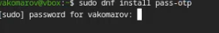{#fig:001 width=70%}

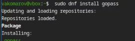{#fig:002 width=70%}

##

2. Просмотрим список ключей. Инициализируем хранилище. Синхронизируемс git Создадим структуру git.

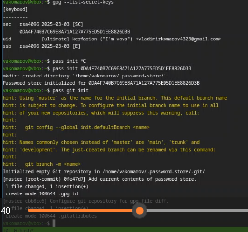{#fig:003 width=70%}

##

3. Также можно задать адрес репозитория на хостинге (репозиторий необходимо предварительно создать).  Для синхронизации выполняется следующая команда:  pass git pull pass git push Следует заметить, что отслеживаются только изменения, сделанные через сам gopass (или pass). Если изменения сделаны непосредственно на файловой системе, необходимо вручную закоммитить и выложить изменения. Проверим статус синхронизации.

{#fig:004 width=70%}

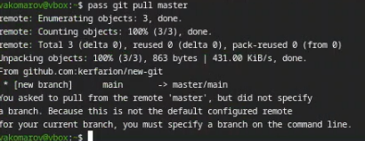{#fig:005 width=70%}

## 

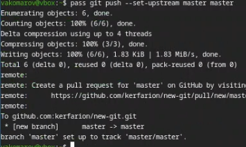{#fig:006 width=70%}

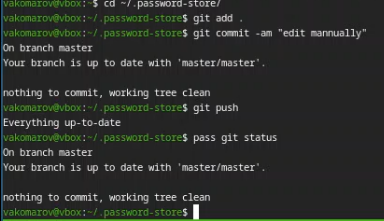{#fig:007 width=70%}

## Настройка интерфейса с броузером

6.  Для взаимодействия с броузером используем интерфейс native messaging. Кроме плагина к броузеру устанавливается программа, обеспечивающая интерфейс native messaging.

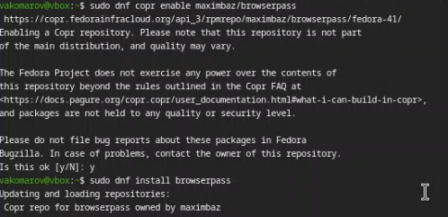{#fig:008 width=70%} 

## Сохранение пароля

9. Добавим новый пароль. Отобразим пароль для указанного имени файла. Заменим существующий пароль:

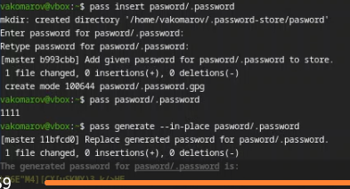{#fig:009 width=70%} 

## Управление файлами конфигурации. Установка. Использование chezmoi 

10. Установим дополнительное программное обеспечение. Установим шрифты.

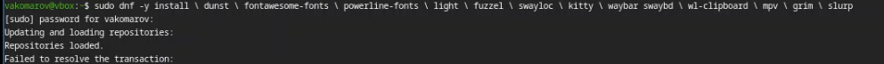{#fig:010 width=70%} 

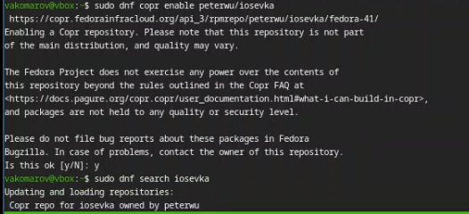{#fig:011 width=70%} 

##

{#fig:012 width=70%}

##

11.  Установим бинарный файл. Создадим собственный репозиторий с помощью утилит Создадим свой репозиторий для конфигурационных файлов на основе шаблона: Инициализируем chezmoi с репозиторием dotfiles:  Проверим, какие изменения внесёт chezmoi в домашний каталог. Запустим: chezmoi apply -v

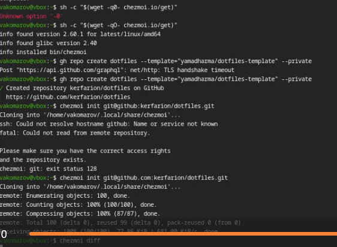{#fig:013 width=70%} 

## 

12. На второй машине инициализируем chezmoi с репозиторием dotfiles. Проверим, какие изменения внесёт chezmoi в домашний каталог. Я настроила репозиторий заранее, поэтому изменений нет.  При существующем каталоге chezmoi можно получить и применить последние изменения из репозитория.   Можно установить свои dotfiles на новый компьютер с помощью одной команды. Извлечем последние изменения из своего репозитория и посмотрим, что изменится, фактически не применяя изменения. Применим изменения. 

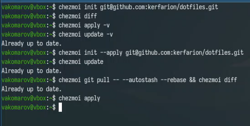{#fig:014 width=70%} 

##

13. Можно автоматически фиксировать и отправлять изменения в исходный каталог в репозиторий. Эта функция отключена по умолчанию. Чтобы включить её, добавим в файл конфигурации ~/.config/chezmoi/chezmoi.toml следущие строки: 

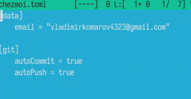{#fig:015 width=70%} 

## Литература

1. Кулябов Д. С. Введерние в операционную систему UNIX - Лекция.
2. Таненбаум Э., Бос Х. Современные операционные системы. - 4-е изд. -СПб. : Питер, 2015. - 1120 с.

## Вывод

Мы познакомились с pass, gopass, native messaging, chezmoi. Научились пользоваться этими утилитами, синхронизировали их с гит.

