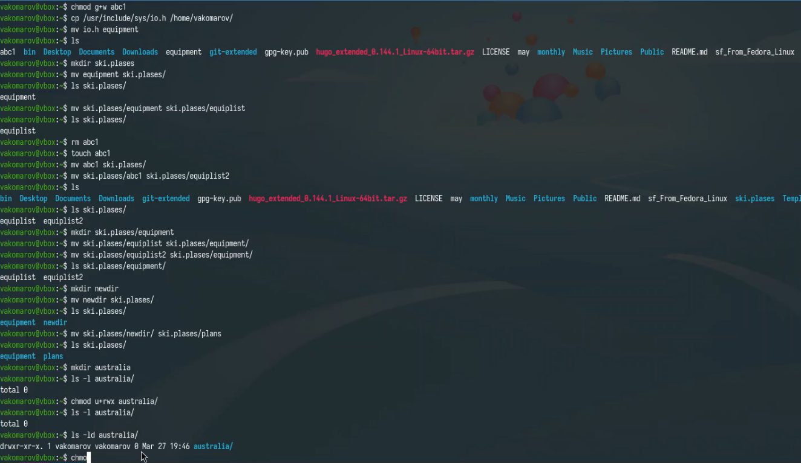
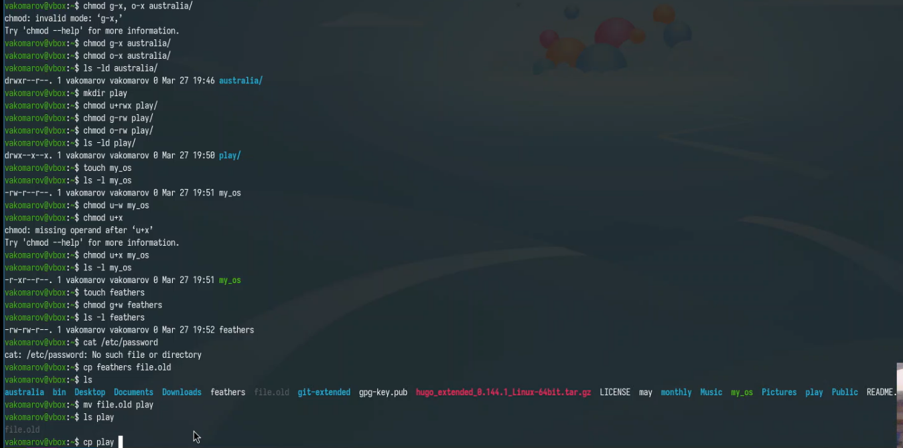
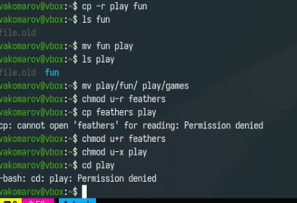

---
## Front matter
lang: ru-RU
title: Отчет по лабораторной работе №3
subtitle: Операционные системы
author:
  - Комаров Владимир Артемович.
institute:
  - Российский университет дружбы народов, Москва, Россия

## i18n babel
babel-lang: russian
babel-otherlangs: english

## Formatting pdf
toc: false
toc-title: Содержание
slide_level: 2
aspectratio: 169
section-titles: true
theme: metropolis
header-includes:
 - \metroset{progressbar=frametitle,sectionpage=progressbar,numbering=fraction}
---

# Информация

## Докладчик

:::::::::::::: {.columns align=center}
::: {.column width="70%"}

  * Комаров Владимир Артемович
  * НКАбд-02-2024 № Студенческого билета: 1132246757
  * Российский университет дружбы народов
  * <https://github.com/kerfarion/study_2024-2025_os-intro>

:::
::: {.column width="30%"}

:::
::::::::::::::

## Цели работы

Цель: Научиться работать с языком разметки markdown

## Задачи

Создать отчёт по лабораторной работе №2.

## Теоретическое введение

Лабораторная работа является небольшой научно-исследовательской работой, которую
и оформлять следует по всем утверждённым требованиям. При подготовке отчета по лабораторной работе вы освоите ряд важных элементов, которые в дальнейшем пригодятся

## Выполнение лабораторной работы

## Создание отчёта

С помощью шаблона из лабораторной работы настраиваю файл report.md и начинаю писать, с помощью специальных команд пишу сам отчёт.

{#fig:001 width=70%}

##

После написания отчёта нужно из файла, в котором находится отчёт сделать команду make, для создания pdf и docx

{#fig:002 width=70%}

## Пуш изменений на гитхаб

Отправляем все изменения файлов на гитхаб

{#fig:003 width=70%}

## Литература

1. Кулябов Д. С. Введерние в операционную систему UNIX - Лекция.
2. Таненбаум Э., Бос Х. Современные операционные системы. - 4-е изд. -СПб. : Питер, 2015. - 1120 с.

## Вывод

Я научился работать с языком разметки Markdown и создал отчёд для лабораторной работы.

