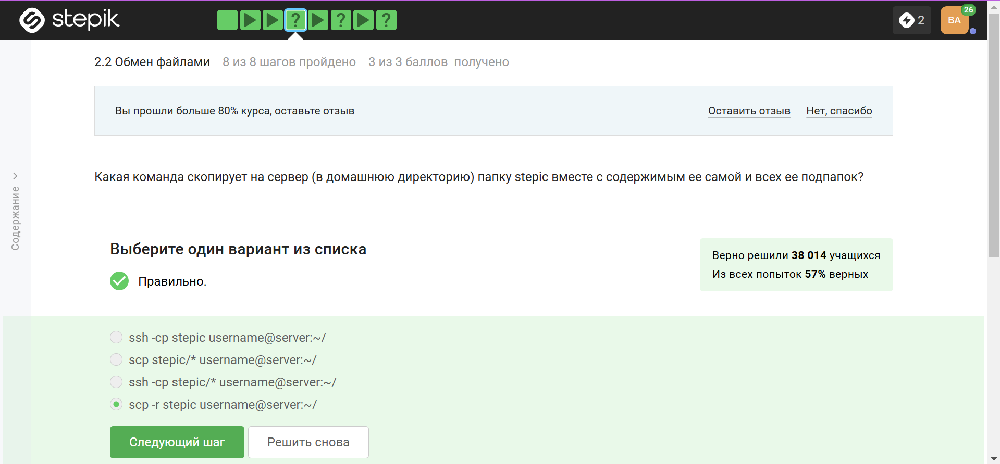

---
## Front matter
lang: ru-RU
title: Отчёт по прохождению метакурса
subtitle: Операционные системы
author:
  - Комаров В. А.
institute:
  - Российский университет дружбы народов, Москва, Россия

## i18n babel
babel-lang: russian
babel-otherlangs: english

## Formatting pdf
toc: false
toc-title: Содержание
slide_level: 2
aspectratio: 169
section-titles: true
theme: metropolis
header-includes:
 - \metroset{progressbar=frametitle,sectionpage=progressbar,numbering=fraction}
---

# Информация

## Докладчик

:::::::::::::: {.columns align=center}
::: {.column width="70%"}

 * Комаров Владимир Артемович
  * НКАбд-02-2024 № Студенческого билета: 1132246757
  * Российский университет дружбы народов

:::
::: {.column width="30%"}

:::
::::::::::::::

# Цель работы

Пройти метакурс по операционным системам и получить необходимые знания для работы с markdown и bash.

# Задание

Пройти все 3 модуля в метакурсе, получить сертификат.

# Выполнение лабораторной работы

## Прохождение первого раздела метакурса: 

{#fig:001 width=70%}

##

{#fig:002 width=70%}

##

{#fig:003 width=70%}

##

{#fig:004 width=70%}

##

{#fig:005 width=70%}

##

{#fig:006 width=70%}

##

{#fig:007 width=70%}

##

{#fig:008 width=70%}

##

{#fig:009 width=70%}

## Прохождение второго раздела метакурса:

{#fig:010 width=70%}

##

{#fig:011 width=70%}

##

{#fig:012 width=70%}

##

{#fig:013 width=70%}

3#

{#fig:014 width=70%}

##

{#fig:015 width=70%}

##

{#fig:016 width=70%}

## Прохождение третьего раздела метакурса:

{#fig:017 width=70%}

##

{#fig:018 width=70%}

##

{#fig:019 width=70%}

##

{#fig:020 width=70%}

##

{#fig:021 width=70%}

##

{#fig:022 width=70%}

##

{#fig:023 width=70%}

# Выводы

Прошел метакурс. Получил и закрепил необходимые знания для работы с языком bash и markdown.

# Список литературы{.unnumbered}

