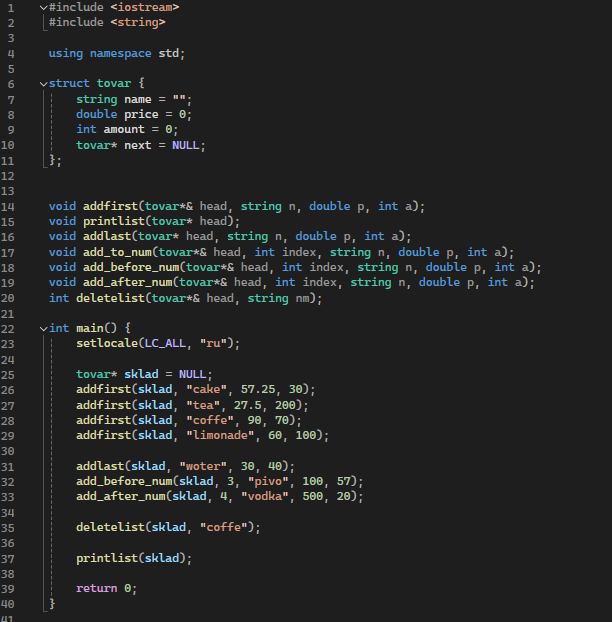
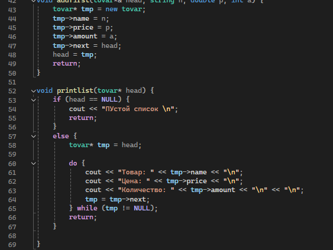
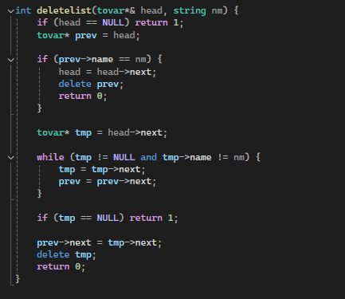
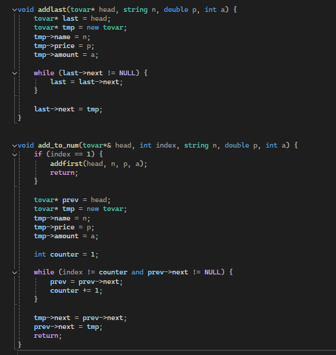
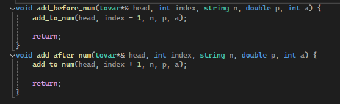

---
## Front matter
title: "Лабораторная работа 1"
subtitle: "Дисциплина: Технологии программирования"
author: "Комаров Владимир Артемович"

## Generic otions
lang: ru-RU
toc-title: "Содержание"

## Bibliography
bibliography: bib/cite.bib
csl: pandoc/csl/gost-r-7-0-5-2008-numeric.csl

## Pdf output format
toc: true # Table of contents
toc-depth: 2
lof: true # List of figures
lot: true # List of tables
fontsize: 12pt
linestretch: 1.5
papersize: a4
documentclass: scrreprt
## I18n polyglossia
polyglossia-lang:
  name: russian
  options:
	- spelling=modern
	- babelshorthands=true
polyglossia-otherlangs:
  name: english
## I18n babel
babel-lang: russian
babel-otherlangs: english
## Fonts
mainfont: IBM Plex Serif
romanfont: IBM Plex Serif
sansfont: IBM Plex Sans
monofont: IBM Plex Mono
mathfont: STIX Two Math
mainfontoptions: Ligatures=Common,Ligatures=TeX,Scale=0.94
romanfontoptions: Ligatures=Common,Ligatures=TeX,Scale=0.94
sansfontoptions: Ligatures=Common,Ligatures=TeX,Scale=MatchLowercase,Scale=0.94
monofontoptions: Scale=MatchLowercase,Scale=0.94,FakeStretch=0.9
mathfontoptions:
## Biblatex
biblatex: true
biblio-style: "gost-numeric"
biblatexoptions:
  - parentracker=true
  - backend=biber
  - hyperref=auto
  - language=auto
  - autolang=other*
  - citestyle=gost-numeric
## Pandoc-crossref LaTeX customization
figureTitle: "Рис."
tableTitle: "Таблица"
listingTitle: "Листинг"
lofTitle: "Список иллюстраций"
lotTitle: "Список таблиц"
lolTitle: "Листинги"
## Misc options
indent: true
header-includes:
  - \usepackage{indentfirst}
  - \usepackage{float} # keep figures where there are in the text
  - \floatplacement{figure}{H} # keep figures where there are in the text
---

# Цель работы

Изучить структуры данных, научиться писать функции для работы со структурами данный, выработать базовое понимание работы структуры данных

# Задание

Написать компьютерную программу, содержащую
                                                                                                          
 - Описание структуры, содержащей поля типа string, int, double;
                                                                                                          
 - Набор функций для работы со списком на базе этой структуры:
                                                                                                          
     - Добавление элемента в начало списка;
                                                                                                          
     - Добавление элемента в конец списка;
                                                                                                          
     - Добавление элемента в список после заданного элемента;
                                                                                                          
     - Добавление элемента в список перед заданным элементом;
                                                                                                          
     - Удаление из списка элемента с заданным именем;
                                                                                                          
     - Вывод содержания списка на экран;
                                                                                                          
 - Функцию main, содержащую сценарий работы со списком, использующий разработанный инструментарий.
                                                                                                          
Представить результаты в виде двух файлов:
                                                                                                          
 - Компьютерная программа на С++;
                                                                                                          
 - Отчет о выполнении лабораторной работы с описанием алгоритма и структуры программы. 

# Выполнение лабораторной работы

Импортирую необходимые библиотеки, описываю структуру содержащую необходимые поля, инициализирую все функции, что будут использованы в дальнейшем и создаю функцию, содержащую сценарий работы со списком.

{#fig:001 width=70%}

Создаю функцию добавления элемента в начало списка и вывода всего списка товаров.

{#fig:002 width=70%}

Создаю функцию удаления из списка по названию.

{#fig:003 width=70%}

Создаю функцию добавления элемента в конец списка и функцию, которую буду использовать в дальнейшем по добавлению элемента на определённое место

{#fig:004 width=70%}

Создаю функцию добавления до хаданного элемента и функцию добавления после заданного элемента с помощью ранее созданной функции добавления на определённое место.

{#fig:005 width=70%}

# Выводы

Я изучил структуры данных, научился писать функции для работы с ними, а так же выработал понимание работы со структурами данных.

# Список литературы{.unnumbered}

