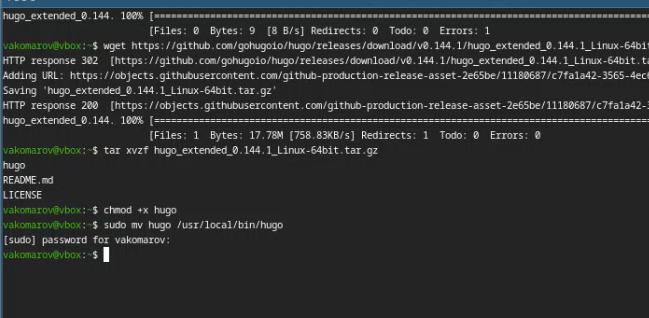
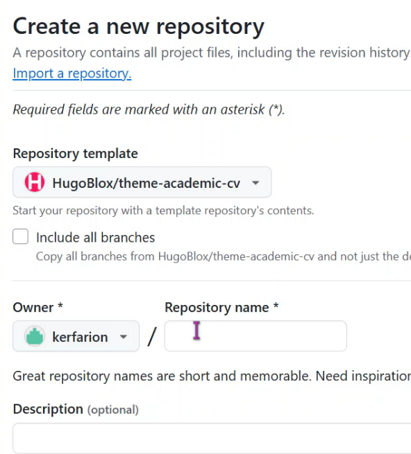
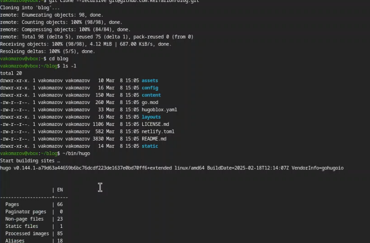
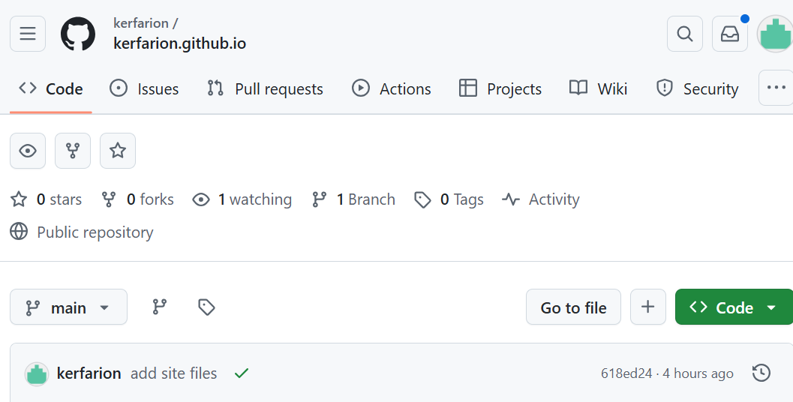
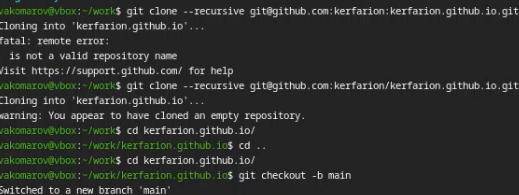
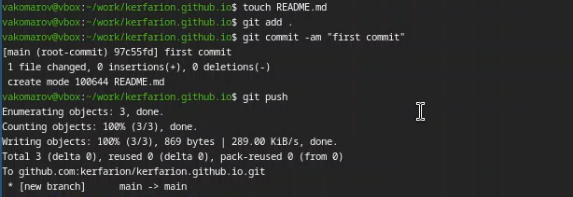
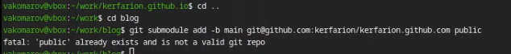
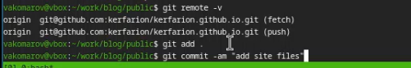
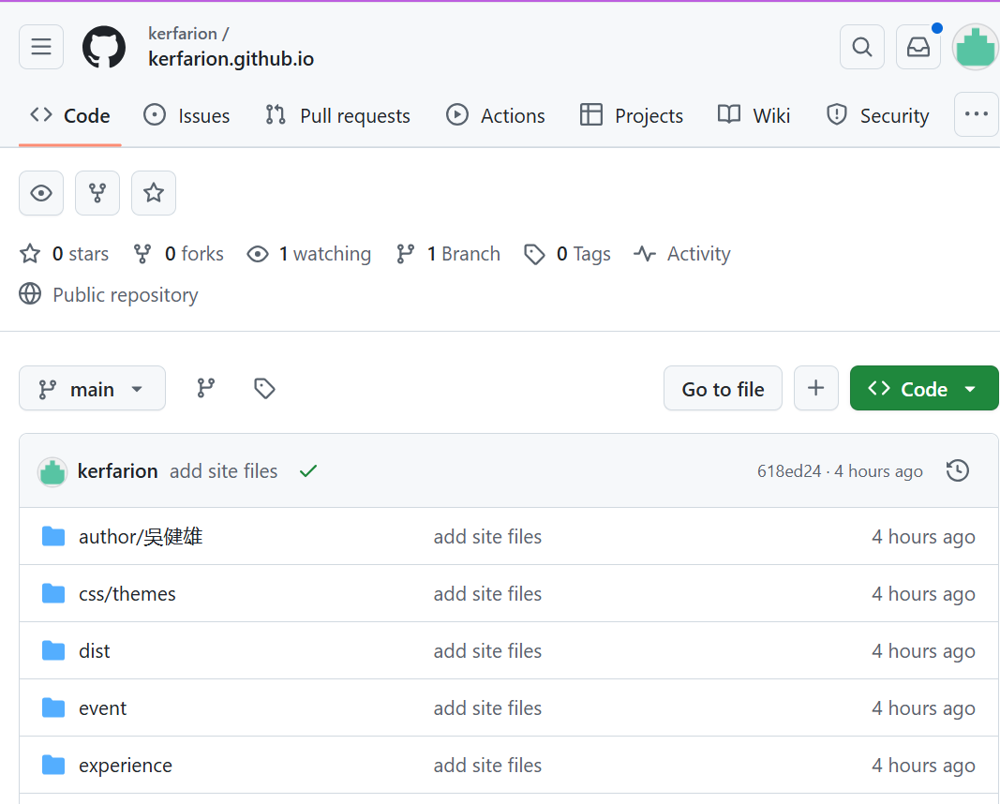

---
## Front matter
lang: ru-RU
title: Отчет по первому этапу проекта
subtitle: Операционные системы
author:
  - Комаров Владимир Артемович
institute:
  - Российский университет дружбы народов, Москва, Россия

## i18n babel
babel-lang: russian
babel-otherlangs: english

## Formatting pdf
toc: false
toc-title: Содержание
slide_level: 2
aspectratio: 169
section-titles: true
theme: metropolis
header-includes:
 - \metroset{progressbar=frametitle,sectionpage=progressbar,numbering=fraction}
---

# Информация

## Докладчик

:::::::::::::: {.columns align=center}
::: {.column width="70%"}

  * Комаров Владимир Артемович
  * НКАбд-02-2024 № Студенческого билета: 1132246757
  * Российский университет дружбы народов
  * <https://github.com/kerfarion/study_2024-2025_os-intro>

:::
::: {.column width="30%"}

:::
::::::::::::::

## Цель работы

Размещение на Github pages заготовки для персонального сайта.

## Задание

1. Установить необходимое программное обеспечение.
2. Скачать шаблон темы сайта.
3. Разместить его на хостинге git.
4. Установить параметр для URLs сайта.
5. Разместить заготовку сайта на Github pages.

## Выполнение лабораторной работы

1. Переходим в режим суперпользователя и устанавливаем go hugo.

{#fig:001 width=70%}

##
2. Создаем репозиторий на github.

{#fig:002 width=70%}

##
3. Скачиваем пакеты данных.

{#fig:003 width=70%}

##
4. Создаем новый репозиторий, клонируем его и проверяем, на какой ветке мы сейчас находимся.

{#fig:004 width=70%}

{#fig:005 width=70%}

##
5. Делаем коммит в этот репозиторий.

{#fig:006 width=70%}

##
6. Добавляем подраздел в ветку main.

{#fig:007 width=70%}

##
7. Делаем коммит подраздела на репозиторий.

{#fig:008 width=70%}

##
8. Проверяем наличие выложенных файлов на репозитории.

{#fig:009 width=70%}

## Литература

1. Кулябов Д. С. Введерние в операционную систему UNIX - Лекция.
2. Таненбаум Э., Бос Х. Современные операционные системы. - 4-е изд. -СПб. : Питер, 2015. - 1120 с.

## Вывод

Разместил на Github pages заготовки для персонального сайта.
:::

